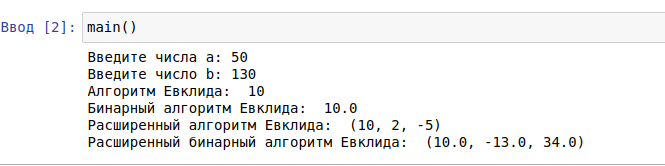

---
## Front matter
lang: ru-RU
title: Шифр гаммирования
author: Гердт Ольга НФИмд-02-21
institute: Российский Университет Дружбы Народов
date: 4 декабря, 2021, Москва, Россия

## Formatting
mainfont: PT Serif
romanfont: PT Serif
sansfont: PT Sans
monofont: PT Mono
toc: false
slide_level: 2
theme: metropolis
header-includes: 
 - \metroset{progressbar=frametitle,sectionpage=progressbar,numbering=fraction}
 - '\makeatletter'
 - '\beamer@ignorenonframefalse'
 - '\makeatother'
aspectratio: 43
section-titles: true

---

# Цели и задачи

## Цель лабораторной работы

Изучение алгоритма Евклида нахождения НОД и его вариаций. Реализовать рассмотренные алгоритмы программно.

# Выполнение лабораторной работы

## Наибольший общий делитель

Наибольший общий делитель (НОД) – это число, которое делит без остатка два числа и делится само без остатка на любой другой делитель данных двух чисел. Проще говоря, это самое большое число, на которое можно без остатка разделить два числа, для которых ищется НОД.

## Алгоритм Евклида

Вход. Целые числа $a, b; 0 < b < a$.
Выход. $d =$ НОД$(a,b)$.

1. Положить $r_0 = a$, $r_1 = b$, $i = 1$.

2. Найти остаток $r_{i+1}$ от деления $r_{i–1}$ на $r_i$.

------

3. Если $r_{i+1} = 0$
   то положить $d = r_i$
   иначе $i = i+1$
   и вернуться на шаг 2.
   
4. Результат: $d$.

## Бинарный алгоритм Евклида

* Вход. Целые числа $a, b; 0 < b ≤ a$.
* Выход. $d =$ HOД$(a,b)$.

1. Положить $g = 1$.

2. Пока оба числа $a$ и $b$ четные, выполнять $a = a/2, b = b/2, g = 2g$ до получения хотя бы одного нечетного значения $a$ или $b$.

3. Положить $u = a, v = b$​.

------

4. Пока $u \neq 0$, выполнять следующие действия.
	
	- Пока $u$ четное, полагать $u = u/2$.
	- Пока $v$ четное, полагать $v = v/2$.
	- При $u \geq v$ положить $u = u - v$. В противном случае положить $v = v – u$.
	
5. Положить $d = gv$.

6. Результат: $d$

## Расширенный алгоритм Евклида

Вход. Целые числа $a, b; 0 < b \leqslant a$.

Выход: $d =$ НОД$(a, b)$; такие целые числа $x, y$, что $ax + by = d$.

1. Положить $r_0=a, r_1=b, x_0=1, x_1=0, y_0=0, y_1=1, i=1$

2. Разделить с остатком $r_{i–1}$ на $r_i$:
   $r_{i-1} = q_i*r_i + r_i + 1$
   
------
   
3. Если $r_{i+1} = 0$:
   то положить $d = r_i$, $x = x_i$, $y = y_i$
   иначе $x_{i+1} = (x_{i-1} – q_i \cdot x_i$, $y_{i+1} = y_{i-1} – q_i \cdot y_i$, $i = i + 1$
   и вернуться на шаг 2.
   
4. Результат: $d, x, y$.

## Расширенный бинарный алгоритм Евклида

Вход. Целые числа: $a, b; 0 < b \leqslant a.$

Выход. $d$ = HOД($a,b$).

1. Положить g = 1.

2. Пока оба числа a и b четные, выполнять:
   $a=a/2$, $b=b/2$, $g=2g$
   до получения хотя бы одного нечетного значения $a$ или $b$.

3. Положить: $u=a, v=b, A=1, B=0, C=0, D=1.$

------

4. Пока $u \neq 0$  выполнять следующие действия

   4.1. Пока $u$ четное:

      4.1.1. Положить $u=u/2.$

      4.1.2. Если оба числа $A$ и $B$ четные, 

   + то положить $A=A/2, B=B/2$

   + иначе $A=(A+b)/2, B=(B-a)/2$ 

------

   4.2. Пока $v$ четное:

      4.2.1. Положить $v=v/2.$

      4.2.2. Если оба числа $C$ и $D$ четные,

   - то положить $C=C/2, D=D/2$

   - иначе $C=(C+b)/2, D=(D-a)/2$

------

   4.3 При $u \geqslant v$

   + положить $u=u-v, A=A-C,B=B-D$

   + иначе $v=v-u,C=C-A, D=D-B.$

5. Положить $d=gv, x=C, y=D.$

6. Результат: $d, x, y.$

## Пример работы алгоритма

{ #fig:001 }

## Результаты выполнения лабораторной работы

Изучили алгоритм Евклида, и его варианты. Реализовали алгоритмы програмно.