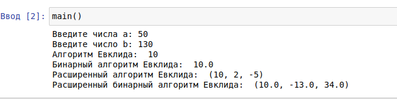

---
# Front matter
title: "Отчёт по лабораторной работе №4"
subtitle: "Алгоритм Евклида"
author: "Гердт Ольга НФИмд-02-21"

# Generic otions
lang: ru-RU
toc-title: "Содержание"

# Bibliography
bibliography: bib/cite.bib
csl: pandoc/csl/gost-r-7-0-5-2008-numeric.csl

# Pdf output format
toc: true # Table of contents
toc_depth: 2
lof: true # List of figures
fontsize: 12pt
linestretch: 1.5
papersize: a4
documentclass: scrreprt
## I18n
polyglossia-lang:
  name: russian
  options:
    - spelling=modern
    - babelshorthands=true
polyglossia-otherlangs:
  name: english
### Fonts
mainfont: PT Serif
romanfont: PT Serif
sansfont: PT Sans
monofont: PT Mono
mainfontoptions: Ligatures=TeX
romanfontoptions: Ligatures=TeX
sansfontoptions: Ligatures=TeX,Scale=MatchLowercase
monofontoptions: Scale=MatchLowercase,Scale=0.9
## Biblatex
biblatex: true
biblio-style: "gost-numeric"
biblatexoptions:
  - parentracker=true
  - backend=biber
  - hyperref=auto
  - language=auto
  - autolang=other*
  - citestyle=gost-numeric
## Misc options
indent: true
header-includes:
  - \linepenalty=10 # the penalty added to the badness of each line within a paragraph (no associated penalty node) Increasing the value makes tex try to have fewer lines in the paragraph.
  - \interlinepenalty=0 # value of the penalty (node) added after each line of a paragraph.
  - \hyphenpenalty=50 # the penalty for line breaking at an automatically inserted hyphen
  - \exhyphenpenalty=50 # the penalty for line breaking at an explicit hyphen
  - \binoppenalty=700 # the penalty for breaking a line at a binary operator
  - \relpenalty=500 # the penalty for breaking a line at a relation
  - \clubpenalty=150 # extra penalty for breaking after first line of a paragraph
  - \widowpenalty=150 # extra penalty for breaking before last line of a paragraph
  - \displaywidowpenalty=50 # extra penalty for breaking before last line before a display math
  - \brokenpenalty=100 # extra penalty for page breaking after a hyphenated line
  - \predisplaypenalty=10000 # penalty for breaking before a display
  - \postdisplaypenalty=0 # penalty for breaking after a display
  - \floatingpenalty = 20000 # penalty for splitting an insertion (can only be split footnote in standard LaTeX)
  - \raggedbottom # or \flushbottom
  - \usepackage{float} # keep figures where there are in the text
  - \floatplacement{figure}{H} # keep figures where there are in the text
---

# Цель работы

Изучение алгоритма Евклида нахождения НОД и его вариаций. Реализовать рассмотренные алгоритмы программно.

# Теоретические сведения

## Наибольший общий делитель

Наибольший общий делитель (НОД) – это число, которое делит без остатка два числа и делится само без остатка на любой другой делитель данных двух чисел. Проще говоря, это самое большое число, на которое можно без остатка разделить два числа, для которых ищется НОД.

## Алгоритм Евклида

**Алгоритм Евклида** – это алгоритм нахождения наибольшего общего делителя (НОД) пары целых чисел.

Алгоритм Евклида

Вход. Целые числа $a, b; 0 < b \leq a$.

Выход. $d =$ НОД$(a,b)$.

1. Положить $r_0 = a$, $r_1 = b$, $i = 1$.
2. Найти остаток $r_{i+1}$ от деления $r_{i–1}$ на $r_i$.
3. Если $r_{i+1} = 0$
   то положить $d = r_i$
   иначе $i = i+1$
   и вернуться на шаг 2.
4. Результат: $d$.

## Бинарный алгоритм Евклида

Бинарный алгоритм Евклида — метод нахождения наибольшего общего делителя двух целых чисел. Возможно, алгоритм был известен еще в Китае 1-го века, но опубликован был лишь в 1967 году израильским физиком и программистом Джозефом Стайном. Он основан на использовании следующих свойств НОД: 

- НОД($2m, 2n$) = 2 НОД($m, n$),
- НОД($2m, 2n+1$) = НОД($m, 2n+1$),
- НОД($-m, n$) = НОД($m, n$)

Вход. Целые числа $a, b; 0 < b ≤ a$.

Выход. $d =$ HOД$(a,b)$.

1. Положить $g = 1$.
2. Пока оба числа $a$ и $b$ четные, выполнять $a = a/2, b = b/2, g = 2g$ до получения хотя бы одного нечетного значения $a$ или $b$.
3. Положить $u = a, v = b$.
4. Пока $u \neq 0$, выполнять следующие действия.
   - Пока $u$ четное, полагать $u = u/2$.
   - Пока $v$ четное, полагать $v = v/2$.
   - При $u \geq v$ положить $u = u - v$. В противном случае положить $v = v – u$.
5. Положить $d = gv$.
6. Результат: $d$

## Расширенный алгоритм Евклида

В то время как "обычный" алгоритм Евклида просто находит наибольший общий делитель двух чисел $a$ и $b$ , расширенный алгоритм Евклида находит помимо НОД также коэффициенты $x$ и $y$ такие, что:
НОД($a, b$) $= a \cdot x+b \cdot y$

Т.е. он находит коэффициенты, с помощью которых НОД двух чисел выражается через сами эти числа.

Вход. Целые числа $a, b; 0 < b \leqslant a$.

Выход: $d =$ НОД$(a, b)$; такие целые числа $x, y$, что $ax + by = d$.

1. Положить $r_0=a, r_1=b, x_0=1, x_1=0, y_0=0, y_1=1, i=1$
2. Разделить с остатком $r_{i–1}$ на $r_i$:
    $r_{i-1} = q_i*r_i + r_i + 1$
3. Если $r_{i+1} = 0$:
   то положить $d = r_i$, $x = x_i$, $y = y_i$
   иначе $x_{i+1} = (x_{i-1} – q_i \cdot x_i$,
                $y_{i+1} = y_{i-1} – q_i \cdot y_i$,
                $i = i + 1$ и вернуться на шаг 2.
4. Результат: $d, x, y$.

## Расширенный бинарный алгоритм Евклида

Вход. Целые числа: $a, b; 0 < b \leqslant a.$

Выход. $d$ = HOД($a,b$).

1. Положить g = 1.

2. Пока оба числа a и b четные, выполнять:
   $a=a/2$, $b=b/2$, $g=2g$
   до получения хотя бы одного нечетного значения $a$ или $b$.

3. Положить: $u=a, v=b, A=1, B=0, C=0, D=1.$

4. Пока $u \neq 0$  выполнять следующие действия
   
   4.1. Пока $u$ четное:
   
      4.1.1. Положить $u=u/2.$
   
      4.1.2. Если оба числа $A$ и $B$ четные, 
   
   + то положить $A=A/2, B=B/2$
   
   + иначе $A=(A+b)/2, B=(B-a)/2$ 
   
   4.2. Пока $v$ четное:
   
      4.2.1. Положить $v=v/2.$
   
      4.2.2. Если оба числа $C$ и $D$ четные,
   
   - то положить $C=C/2, D=D/2$
   
   - иначе $C=(C+b)/2, D=(D-a)/2$
   
   4.3 При $u \geqslant v$
   
   + положить $u=u-v, A=A-C,B=B-D$
   
   + иначе $v=v-u,C=C-A, D=D-B.$

5. Положить $d=gv, x=C, y=D.$

6. Результат: $d, x, y.$

# Выполнение работы

## Реализация алгоритмов на языке Python

```
# Алгоритм Евклида
def evklid(a,b):
    while a != 0 and b != 0:
        if a >= b:
            a %= b
        else:
            b %= a
    return a or b

# Бинарный алгоритм Евклида
def binary_evklid(a,b):
    g = 1
    while(a % 2 == 0 and b % 2 == 0):
        a = a/2
        b = b/2
        g = 2*g
    u,v = a,b
    while u != 0:
        if u % 2 == 0:
            u = u/2
        if v % 2 == 0:
            v = v/2
        if u >= v:
            u = u - v
        else:
            v = v - u
    d = g*v
    return d

#  Расширенный алгоритм Евклида
def evklid_extended(a, b):
    if a == 0:
        return (b, 0, 1)
    else:
        div, x, y = evklid_extended(b % a, a)
    return (div, y - (b // a) * x, x)

# Расширенный бинарный алгоритм Евклида
def evklid_binary_extended(a, b):
    g = 1
    while (a % 2 == 0 and b % 2 == 0):
        a = a / 2
        b = b / 2
        g = 2 * g
    u = a
    v = b
    A = 1
    B = 0
    C = 0
    D = 1
    while u != 0:
        if u % 2 == 0:
            u = u/2
            if A % 2 == 0 and B % 2 ==0:
                A = A/2
                B = B/2
            else:
                A = (A+b)/2
                B = (B-a)/2
        if v % 2 == 0:
            v = v / 2
            if C%2==0 and D%2==0:
                C = C/2
                D = D/2
            else:
                C = (C+b)/2
                D = (D-a)/2
        if u>=v:
            u = u - v
            A = A - C
            B = B - D
        else:
            v = v - u
            C = C - A
            D = D - B
    d = g*v
    x = C
    y = D
    return (d,x,y)

def zapusk(a, b):
    print("Алгоритм Евклида: ", evklid(a,b))
    print("Бинарный алгоритм Евклида: ", binary_evklid(a,b))
    print("Расширенный алгоритм Евклида: ", evklid_extended(a,b))
    print("Расширенный бинарный алгоритм Евклида: ", evklid_binary_extended(a,b))
    
def main():
    a = int(input("Введите числа a: "))
    b = int(input("Введите число b: "))
    if a > b and b > 0:
        zapusk(a, b)
    elif a <= b and a > 0:
        a, b = b, a 
        zapusk(a, b)
    else:
        print("Введены не коректные данные.")
```

## Контрольный пример

{ #fig:001 }

# Выводы

Изучили алгоритм Евклида, и его варианты. Реализовали алгоритмы програмно.

# Список литературы

1. [Алгоритм Евклида - нахождение наибольшего общего делителя](https://younglinux.info/algorithm/euclidean)
2. [Бинарный алгоритм вычисления НОД](https://ru.wikipedia.org/wiki/%D0%91%D0%B8%D0%BD%D0%B0%D1%80%D0%BD%D1%8B%D0%B9_%D0%B0%D0%BB%D0%B3%D0%BE%D1%80%D0%B8%D1%82%D0%BC_%D0%B2%D1%8B%D1%87%D0%B8%D1%81%D0%BB%D0%B5%D0%BD%D0%B8%D1%8F_%D0%9D%D0%9E%D0%94#cite_note-1)
3. [Расширенный алгоритм Евклида](https://spravochnick.ru/informatika/rasshirennyy_algoritm_evklida/)
4. [Расширенный алгоритм Евклида](https://aspektcenter.ru/rasshirennyy-algoritm-yevklida-s-tablitsey/)